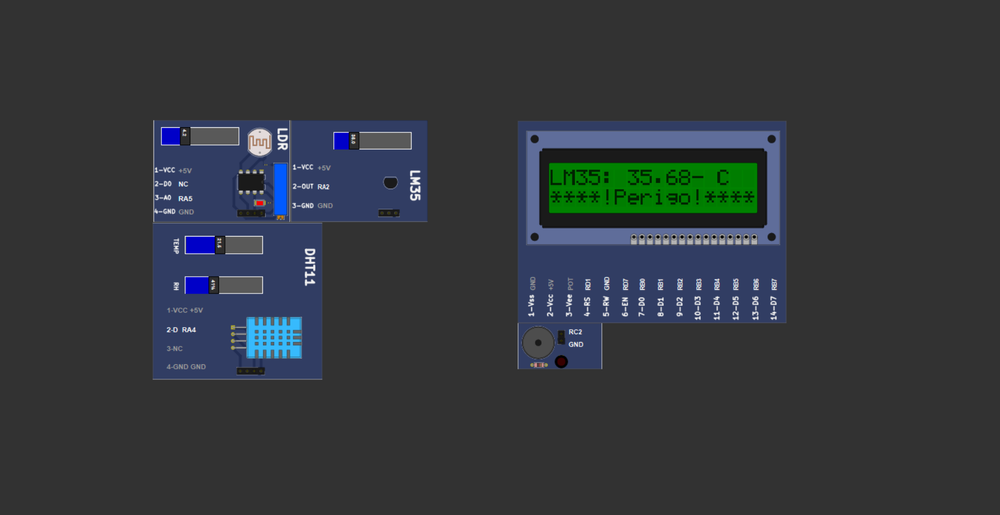

## 🚀 Como Executar

Você pode executar o projeto de duas formas:

### Opção 1: Baixar os arquivos manualmente

1. Baixe o *`.zip`* do repositório.
1. Busque a pasta do projeto dentro da pasta **`/MPLABXProjects`** do MPLAB.
3. Descarregue o arquivo compactado na pasta escolhida (exemplo: **`TestePlaca.X`**). 
4. Abra o MPLAB na pasta do projeto.
5. Configure a pasta como projeto principal.
6. De o comando **`Shift`** + **`F11`** ou clique no botão **Clean and Build Main Project**.
7. Se o programa executou sem falhas a instalação foi feita com sucesso.


### Opção 2: Clonar via Git

1. Abra o terminal ou prompt de comando.
2. Clone o repositório para sua pasta de desejo com o comando:  
    ```bash
        cd caminho/da/sua/pasta.X
        git init #caso já não tenha sido iniciado
        git clone https://github.com/AlexandreComp456890/FireCatcher_proj.git
    ```
3. Faça o processo da **Opção 1** do passo 4 ao 6.


## 🖥️ Como Simular (PicSimLab)

Esse projeto pode ser simulado no PicSimLab da seguinte maneira: 



#### Dispositivos:

- **Inputs:**

    - LM35 (Sensor de Temperatura):
        - 2-OUT => RA2 (AN2).
    - LDR (Fotoresistencia):
        - 2-D0 => NC (sem conexão);
        - 3-A0 => RA5 (AN4).
    - DHT11 (Sensor de umidade):
        - 2-D => RA4.

- **Outputs:**

    - Display LCD 16x2:
        - 4-RS => RD1;
        - 5-RW => GND;
        - 6-EN => RD7;
        - 7-D0 => RB0;
        - 8-D1 => RB1;
        - 9-D2 => RB2;
        - 10-D3 => RB3;
        - 11-D4 => RB4;
        - 12-D5 => RB5;
        - 13-D6 => RB6;
        - 14-D7 => RB7.
    - Buzzer (Ativo):
        - RC2 (PWM).